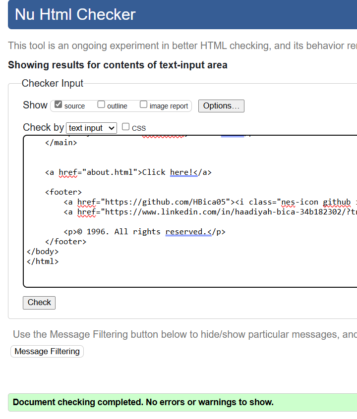
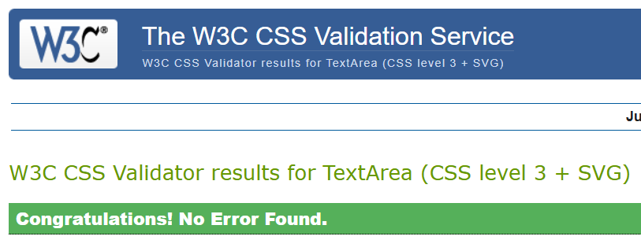

# 🖥️💡 Vintage Visionary

Welcome to my Vintage Visionary portfolio! This site is a nostalgic throwback to the early days of the internet, designed with the aesthetic of the mid-90s web. With retro fonts, gifs and a classic layout, this site captures the charm of the early web era, offering a glimpse into the personal and professional aspects of my journey.

## 🎨 Features:
* Classic 1996 Design: Inspired by the simple and iconic designs of the '90s, this website uses elements such as bright backgrounds, animated GIFs, and text-based navigation that recall the charm of early web pages.
  
* Responsive Layout: While we’re celebrating the past, I’ve made sure the site works well on modern devices, with simple CSS that ensures a smooth viewing experience on both desktop and mobile.

* Skills Showcase: A dedicated section highlighting my technical skills in HTML and CSS, presented in a fun and nostalgic way.

* Vintage Touch: The site includes elements like old-school "Guestbook" features (using modern methods) and simple image animations, reminiscent of early web designs.

## 🌟 Purpose:
This website was created for fun and as a way to travel through creativity. It’s a tribute to the early internet era, when websites were simple, colorful, and full of personality. The design captures the spirit of the 1990s web, featuring elements like pixelated fonts, animated GIFs, and basic HTML layouts.

Through this project, I aim to offer an experience that is both a nostalgic trip for those who remember the early days of the web and a creative playground for those exploring web design today. Whether you are a fellow developer or simply a visitor, I hope this site sparks some joy and inspiration!

## 🔧🖥️ Technologies Used:

* HTML: The backbone of the website, using basic, clean HTML for structure.

* CSS: Styled using simple CSS, with retro design choices like pixelated fonts, vivid colors, and glowing text effects.
  
* Images and GIFs: All images and animated GIFs are chosen to reflect the fun, quirky vibe of 1990s web culture.

## 🐞 Bugs
- No bugs remaining.

## Testing: 
* HTML:
  - The HTML was run through the W3C HTML Validator and no errors:
  
  

* CSS:
  - The CSS was tested using the W3C CSS Validator with no errors:
  
  

## 🧐 How to View:
This portfolio is best viewed in a modern browser for full compatibility with HTML5 and CSS3 standards, but it also has a nostalgic touch with elements that resemble older web pages. Make sure to enable images and be ready for a trip down memory lane with those animated GIFs!

## 🚀 Deployment
The site is deployed using Vercel, making it easy for you to view and explore. For local development or modifications, you can clone the repository.

## 🔁 Cloning of the Repository Code locally
1. Go to the GitHub repository for this project.
2. Click on the Code button above the project files.
3. Copy the HTTPS link of the repository.
4. Open your IDE or terminal, and paste the URL to clone the repository.
5. You're all set! Now you can run the project locally.

## 🏆 Credits
A big thank you to the following resources and tools that made this project possible:

* [Google Fonts](https://fonts.google.com/) : For providing the fantastic fonts used in the project.
* Vercel App: Hosting the deployment of this portfolio site.
* [Gifcities](https://gifcities.org/): Source for nostalgic GIFs that bring the site to life.
* [W3Schools](https://www.w3schools.com/): For HTML and CSS support and examples.
* [StackOverflow](https://stackoverflow.com/): The amazing community that helped me solve various coding challenges.
* [W3C HTML Validator](https://validator.w3.org/): For ensuring my HTML is up to standard.
* [W3C Jigsaw CSS Validator](https://jigsaw.w3.org/css-validator/): For validating my CSS code.
* [Ness.css](https://github.com/nostalgic-css/NES.css?tab=readme-ov-file): A retro design framework that provided pixelated text and cursor styles for a vintage look.

## 📞 Contact
Feel free to reach out to me via email or connect with me on social media. I’m always excited to collaborate on creative projects or chat about web design!
- [LinkedIn]()
- Gmail: bicahaadiyah@gmail.com