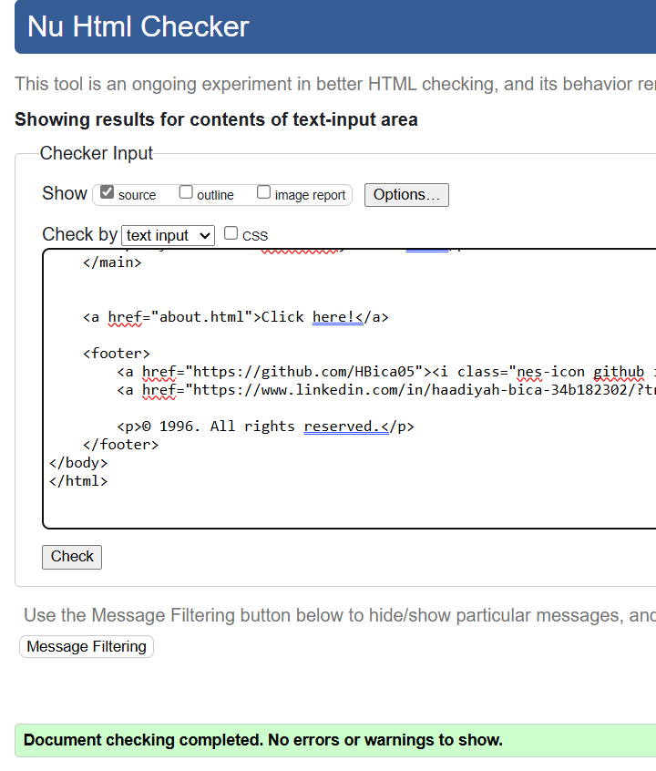
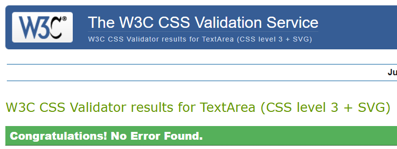

# 🖥️ Vintage Visionary

> *A nostalgic trip to the early internet — built by a future full-stack developer.*


---

## 📖 About the Project

**Vintage Visionary** is a personal portfolio website built as a love letter to the early days of the internet. Designed with the aesthetic of the mid-90s web — complete with pixelated fonts, animated GIFs, scanline overlays, and retro colour palettes — this site blends nostalgia with modern web standards.

Originally created for a hackathon, the project grew into a full creative showcase of my journey as a student at **Code Institute Dublin**, where I specialise in front-end development.

---

## 🌐 Live Demo

🔗 [View the live site](https://vintage-visionary.vercel.app/)

---

## 🎨 Features

| Feature | Description |
|---|---|
| 🕹️ Retro Design | Inspired by 1996-era GeoCities sites, with pixel fonts, vivid colours, and animated GIFs |
| 📺 CRT Scanline Effect | CSS overlay recreates the look of an old cathode-ray tube monitor |
| 🎵 Optional BGM | Background music player with a user-controlled toggle — no autoplay surprises |
| 🎮 Skill Select Screen | Skills page designed like a retro video game character select screen with XP bars |
| 📜 Letter-style About Page | About Me written as a handwritten letter with a dashed-border paper card |
| ✨ Scroll Animations | Elements fade and rise in on scroll using the Intersection Observer API |
| 📱 Responsive Layout | Works on desktop and mobile, despite the retro aesthetic |
| ⭐ Consistent Navigation | Shared nav, footer, and audio bar across all pages |

---

## 📁 Project Structure

```
assets/
├── audio/
│   ├── simple.mp3
│   └── vintage_sound.mp3
├── css/
│   └── base.css
├── images/
│   ├── retro_img.jpg
│   ├── old_paper.jpg
│   └── vintage_tv.webp
└── js/
    └── main.js
```

---

## 🔧 Technologies Used

- **HTML5** — Semantic, clean structure across all three pages
- **CSS3** — Custom retro styles: pixelated fonts, glowing text, CRT scanlines, NES-style containers
- **JavaScript** — Audio toggle, animated star background, scroll-reveal on elements
- **[NES.css](https://github.com/nostalgic-css/NES.css)** — Retro pixel UI framework for containers, buttons, and progress bars
- **[Press Start 2P](https://fonts.google.com/specimen/Press+Start+2P)** — Google Font giving that authentic arcade display look
- **[VT323](https://fonts.google.com/specimen/VT323)** — Secondary retro monospace font
- **Animated GIFs** — Sourced from the [GifCities](https://gifcities.org/) GeoCities archive

---

## 🖼️ Screenshots

> *(Add screenshots of each page here once deployed)*

| Home | About | Skills |
|------|-------|--------|
|  |  |  |

---

## ✅ Testing

### HTML Validation
All pages were run through the [W3C HTML Validator](https://validator.w3.org/) with no errors.



### CSS Validation
Stylesheets were tested using the [W3C CSS Validator (Jigsaw)](https://jigsaw.w3.org/css-validator/) with no errors.



### Manual Testing

| Test | Expected | Result |
|------|----------|--------|
| Nav links work on all pages | Navigate correctly between pages | ✅ Pass |
| Audio toggle plays/pauses BGM | Button toggles audio on click | ✅ Pass |
| GIFs load on all pages | All geocities archive GIFs visible | ✅ Pass |
| Responsive on mobile (375px) | Layout stacks cleanly | ✅ Pass |
| Responsive on tablet (768px) | Layout adapts correctly | ✅ Pass |
| Hover effects on links & buttons | Glow / scale effects trigger | ✅ Pass |
| Footer links open correct pages | GitHub and LinkedIn open in new tab | ✅ Pass |

---

## 🐞 Known Bugs

- Audio file `vintage_sound(1).mp3` was renamed to `vintage_sound.mp3` 
  to fix a path error caused by special characters in the filename. ✅ Fixed.
- `main.js` was initially missing from the project, causing the audio 
  toggle button to fail silently. ✅ Fixed.

---

## 🚀 Deployment

This site is deployed via **[Vercel](https://vercel.com/)**.

To deploy your own copy:
1. Push the repository to GitHub
2. Go to [vercel.com](https://vercel.com/) and import the repo
3. Vercel auto-detects it as a static site — click **Deploy**
4. Your site will be live at `https://your-project.vercel.app`

---

## 💻 Running Locally

1. Clone the repository:
   ```bash
   git clone https://github.com/HBica05/vintage-visionary.git
   ```
2. Navigate into the project folder:
   ```bash
   cd vintage-visionary
   ```
3. Open `index.html` in your browser — or use the [Live Server](https://marketplace.visualstudio.com/items?itemName=ritwickdey.LiveServer) extension in VS Code for best results.

> 💡 **Tip:** No build step or dependencies needed. This is pure HTML, CSS, and JavaScript.

---

## 🏆 Credits & Resources

| Resource | Use |
|----------|-----|
| [Google Fonts](https://fonts.google.com/) | Press Start 2P & VT323 pixel fonts |
| [NES.css](https://github.com/nostalgic-css/NES.css) | Retro pixel UI components |
| [GifCities](https://gifcities.org/) | Animated GIFs from the GeoCities archive |
| [W3C HTML Validator](https://validator.w3.org/) | HTML validation |
| [W3C CSS Validator](https://jigsaw.w3.org/css-validator/) | CSS validation |
| [Vercel](https://vercel.com/) | Deployment & hosting |
| [W3Schools](https://www.w3schools.com/) | HTML & CSS reference |
| [Stack Overflow](https://stackoverflow.com/) | Community troubleshooting support |

---

## 📞 Contact

Made with 💾 by **Haadiyah Bica**

- 🔗 [LinkedIn](https://www.linkedin.com/in/haadiyah-bica-34b182302/)
- 🐙 [GitHub](https://github.com/HBica05)
- 📧 bicahaadiyah@gmail.com

---

*© 1996 Haadiyah Bica. All rights reserved. Best viewed in Netscape Navigator. 🌐*